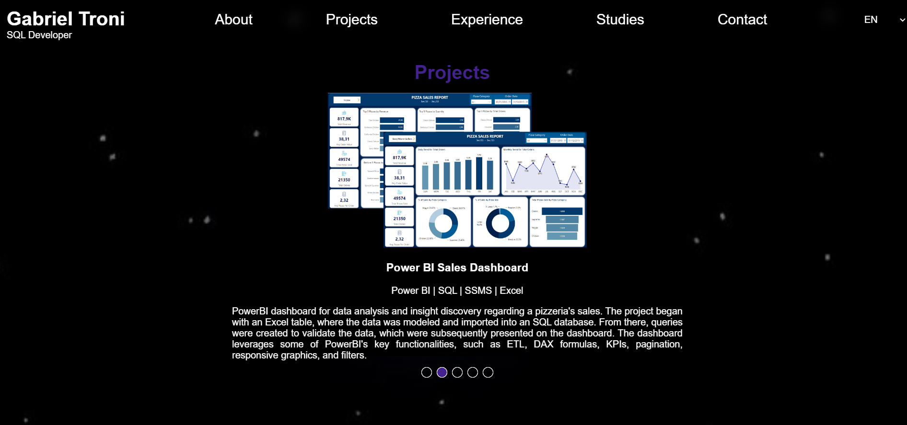

# my_website
My personal website servers as a plataform where I share information about myself, my projects, technical skills and professional experiences. It's a means to present my work in an organized manner and make it accessible to potential employers, collaborators and those interested. The website features a native translation into Brazilian Portuguese and English.

Currently, my website only contains the highlighted education. If you want to see the entire list of courses, bootcamps, awards and other extracurricular activities, visit my LinkedIn via the link below:

<a href="https://www.linkedin.com/in/gabriel-troni/">LinkedIn </a>.

## Technologies Used
- Javascript
- CSS
- HTML

## Features
- Private domain
- Built-in translation for Brazilian Portuguese and English
- Responsiveness

## Screenshots

  
  
  
  

